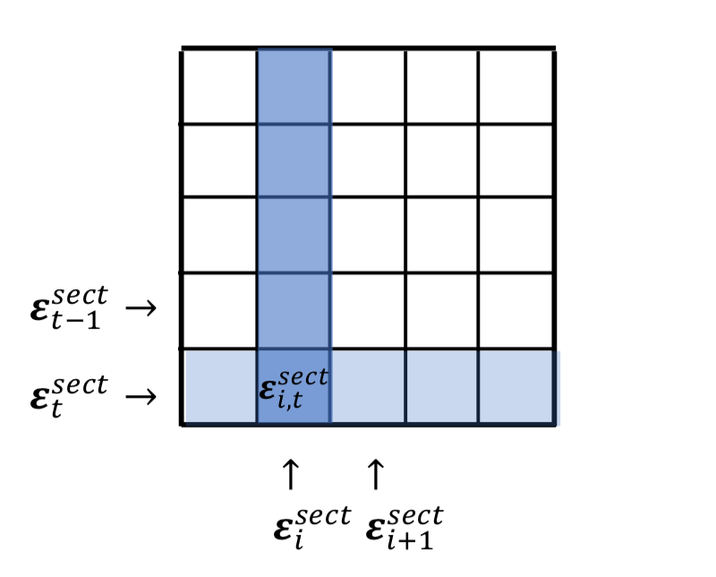
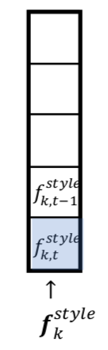

[Quantopian风险模型白皮书(原文翻译)](https://www.quantopian.com/papers/risk)

# 概要

风险建模是一个功能强大的工具，可用于了解和管理投资组合中的风险来源。 在本文中，我们列出了Quantopian风险模型（QRM）的逻辑和实现。股权风险因子模型由Quantopian开发，用于分解和归因于任意股权投资策略承担的风险敞口。 通过定义风险来源，可以将残余或剩余项视为策略的“alpha”，也可以将其视为源自技能的投资策略收益的一部分。 结合其他一些工具，Quantopian使用QRM观察一段时间内的投资组合持有量，来评估量化交易策略。

# 介绍
风险管理考虑了我们如何有意识地确定为了实现未来收益我们愿意承担多少风险。 此过程涉及：

1. 识别风险来源
2. 量化这些风险源的风险敞口
3. 确定那些风险敞口的影响
4. 制定缓解策略
5. 观察后续业绩并根据需要修改缓解策略

风险来自投资组合未来损失和收益的不确定性，不同的个人和机构对风险的承受能力也不同。 $T$个周期内的投资组合总风险为该投资组合收益的标准偏差：
$$\sigma = {\sqrt{{1 \over T} {\sum_{l=1}^T} (r_l - \bar{r})^2 }}$$

此处
- $r_l$为时点$l$的收益率
- $\bar{r}$为$T$个周期内的投资组合平均收益率

这是一种常见的风险定义，可以捕获足够的信息以达到我们的目的。它对称地处理损益，可用于评估各种级别的投资组合，从单个资产到投资组合本身。标准偏差（也称为波动率）使我们了解了期望值相对于平均值波动的程度。一个普遍的经验法则是，大约68％的值位于平均值的一个标准偏差内，95％的值位于平均值的两个标准偏差内，而99％的值位于平均值的三个标准偏差内。较低标准偏差的观察值大部分集中在总体平均值附近，而较高标准偏差的观察值则包含更多极值。这符合关于财务回报的普遍直觉。较多极值导致资产更大的波动，从而带来更大的获利和破产的机会。

评估风险不仅仅是评估潜在损失的数量。 它使我们能够为收益设定合理的期望，并就潜在投资做出明智的决定。 量化与投资组合相关的风险来源可以揭示投资组合实际在多大程度上实现了既定的投资目标。 例如，如果将一项投资策略描述为目标市场和行业中性，则基础投资组合不会因长期多头风险敞口于技术行业而获得可观的回报。 尽管此策略可能会在给定的时间段内显示出利润，但了解到这些利润是基于对单个行业的意外下注而获得的，可能会使投资者对是否分配以及如何分配资本做出不同的决定。 量化风险敞口可使投资者和管理人员制定风险管理策略并完善其投资组合。

建立风险模型可以明确区分常见风险和特定风险。共同风险在此定义为归因于共同因子的风险，这些共同因子会驱动股票市场的收益。这些因子可以由有关构成市场的基础投资资产的基础信息或统计信息组成。 基础因子通常是观察发行股票公司的基本比率，例如账面价值与股价之比或每股收益。 这些因子通常来自于金融机构和宏观经济数据中心。统计因子使用数学模型来解释资产收益时间序列之间的相关性，而无需考虑公司的基本数据（Axioma，Inc. 2011）。

一些经常使用的风险因子包括总体市场指数，在资本资产定价模型(CAPM)(Sharpe 1964)中，风险归因于投资行业，这使人们对公司所处的行业空间有所了解。例如BARRA风险模型（BARRA，Inc. 1998）中的主题因子，或模仿Fama-French 3因子模型中的“小盘”公司或“高增长”公司等投资风格的主题因子。

特定风险在此定义为风险模型中包含的常见风险因素无法解释的风险。通常，这表示为在考虑了常见风险后剩余的残余成分（Axioma，Inc. 2011）。当我们在量化交易的背景下考虑风险管理时，我们对风险的理解在很大程度上用于阐明我们对“ alpha”的定义。在考虑了投资组合的公因子风险后，该残差可以被认为是投资组合的alpha的替代或估计。

# 因子模型

因子建模和因子风险概念的第一个常见介绍是资本资产定价模型（CAPM）。 在CAPM中，我们仅使用单个共同因子风险（市场本身的收益）来定义收益与共同因子风险之间的均衡关系。 CAPM表示任何单个资产的回报，如下所示：
$$E[r_i] = r_f + \beta^M_i (r_M - r_f)$$此处
- $r_f$是无风险收益率
- $r_M$是市场收益率
- $\beta^M_i = {COV[r_i,r_m] \over VAR[r_M]}$是市场对第i项资产的超额收益的影响

CAPM将单个资产的收益分解为整个市场所解释的收益部分，以及无风险资产的预期收益部分。 这是对市场的一种简单化的看法，并未在经验检验中得到证实。 自CAPM成立以来，已经对CAPM进行了许多改进，例如Fama-French三因素模型（Fama和French，1993年），该模型从单一风险源扩展到包括公司规模和公司价值两个额外风险源。 。 Fama-French三因素模型可以表示为：
$$r_i = r_f + \beta^M_i(r_M - r_f) + \beta^{SMB}_ir_{SMB} + \beta^{HML}_ir_{HML} + \alpha_i$$此处
- $r_{SMB}$是小市值股票相对于大市值股票（SMB）的风险溢价收益
- $r_{HML}$是高账面比市值率股票相对于低账面比市值率股票（HML）的风险溢价收益
- $\beta^{SMB}_i$是$r_i$相对于$SMB$的风险敞口
- $\beta^{HML}_i$是$r_i$相对于$HML$的风险敞口
- $\alpha_i$是资产$i$无法解释的收益率部分

作为最后一个例子，套利定价理论（APT）（Ross 1976）是CAPM和类似模型的概括，可测度多个因子的影响。 APT使用多元线性回归（线性因子模型）来表达单个资产的回报，如下所示：
$$r_i = \alpha_i + \beta_{i,0}F_0 + \beta_{i,1}F_1 + ... + \beta_{i,m}F_m+ \epsilon_i$$此处
- $F_j,j \text{ } \epsilon \text { } \{0,m\}$是模型中共同因子收益率集合
- $\beta_{i,j},j \text{ } \epsilon \text { } \{0,m\}$是$r_i$相对于各个共同因子的风险敞口
- $\alpha_i$是资产$i$无法解释的收益率
- $\epsilon_i$是资产$i$的特质影响部分

APT中的因子是单个特征整体影响的结果。在Fama-French模型中，我们解释收益的方法仅限于市场，SMB和HML，而使用APT，我们可以根据需要添加任意多个因子，以说明与我们相关的各种常见因子。**APT构成了Quantopian风险模型的基础**。

# 完成
QRM是一种多因子风险模型，旨在分解16个独立基本因子的各资产的收益率。该模型中的16个因子包括11个行业因子和5个主题因子。 QRM并未单独建模市场因子。选择作为共同风险因子是基于它们彼此之间的独立程度，同时力图解释市场上最大数量资产的收益率。

根据定义，QRM设计旨在对历史风险和当前风险进行建模，而不是用作风险预测工具。

本节开始QRM的技术实施。

## 记号指南

基本符号约定摘要：

+ 小写字母表示向量，例如$a$
+ 大写字母表示矩阵，例如$A$
+ 带下标的大写字母$\text{:,}j$表示矩阵$A$的$j^{th}$列，例如$A_{:,j}$
+ 带下标的大写字母$i\text{,:}$表示矩阵$A$的$i^{th}$行，例如$A_{i,:}$

## 数学模型
QRM数学形式：
$$r_{i,t} = \sum_{j=1}^n\beta_{i,j,t}^{sect}f_{j,t}^{sect} + \sum_{k=1}^m\beta_{i,j,t}^{style}f_{j,t}^{style} + \epsilon_{i,t} \tag1$$
此处
- $r_{i,t}$是资产$i$在时点$t$的收益率
- $n$是行业因子【Sector Factor 译为 行业因子】数量
- $m$是主题因子【Style Factor 译为 主题因子】数量
- $\beta_{i,j,t}^{sect}$是资产$i$在时点$t$的$j^{th}$行业因子风险敞口。也称为因子加载。 它测量因变量和潜在因子之间的关系。对于资产$i$，如其不属于$j^{th}$行业，则$\beta_{i,j,t}^{sect}$为零。
- $f_{j,t}^{sect}$是第$j^{th}$行业在时点$t$的收益率
- $\beta_{i,k,t}^{style}$是资产$i$在时点$t$的$k^{th}$主题风险敞口
- $f_{k,t}^{style}$是时点$t$第$k^{th}$主题因子收益率
- $\epsilon_{i,t}$是模型(1)中在时点$t$资产$i$的残余项

数学模型(1)分解为子模型(1a)
$$r_{i,t} = \sum_{j=1}^n\beta_{i,j,t}^{sect}f_{j,t}^{sect} + \epsilon_{i,t}^{sect}\tag{1a}$$和子模型(1b)$$\epsilon_{i,t}^{sect} = \sum_{k=1}^m\beta_{i,k,t}^{style}f_{k,t}^{style} + \epsilon_{i,t}\tag{1b}$$此处
- $\epsilon_{i,t}^{sect}$是子模型(1a)中资产$i$在时点$t$的残余项

## 行业因子

行业因子用来代表不同行业的影响。 QRM使用由Morningstar（Morningstar，Inc. n.d.）行业分类定义。 此外，QRM使用行业ETF收益代表相应的行业因子收益。 下表将每个行业映射到其在数学模型（1）中的索引，相应的ETF，Morningstar行业代码，Quantopian证券标识符（SID）和Quantopian API中使用的变量名。

<table class="quanto-table-v2">
<thead>
<tr>
<td>Sector</td>
<td>Sector index <mi>j</mi></math>" role="presentation" style="font-size: 110%; position: relative;">j<math xmlns="http://www.w3.org/1998/Math/MathML"><mi>j</mi></math></td>
<td>ETF</td>
<td>Morningstar code</td>
<td>SID</td>
<td>Variable name in the Quantopian API</td>
</tr>
</thead>
<tbody>
<tr>
<td>Materials</td>
<td>1</td>
<td>XLB</td>
<td>101 - Basic Materials</td>
<td>19654</td>
<td>materials</td>
</tr>
<tr>
<td>Consumer Discretionary SPDR</td>
<td>2</td>
<td>XLY</td>
<td>102 - Consumer Cyclical</td>
<td>19662</td>
<td>consumer_discretionary</td>
</tr>
<tr>
<td>Financials</td>
<td>3</td>
<td>XLF</td>
<td>103 - Financial Services</td>
<td>19656</td>
<td>financials</td>
</tr>
<tr>
<td>Real Estate</td>
<td>4</td>
<td>IYR</td>
<td>104 - Real Estate</td>
<td>21652</td>
<td>real_estate</td>
</tr>
<tr>
<td>Consumer Staples</td>
<td>5</td>
<td>XLP</td>
<td>205 - Consumer Defensive</td>
<td>19659</td>
<td>consumer_staples</td>
</tr>
<tr>
<td>Healthcare</td>
<td>6</td>
<td>XLV</td>
<td>206 - Healthcare</td>
<td>19661</td>
<td>health_care</td>
</tr>
<tr>
<td>Utilities</td>
<td>7</td>
<td>XLU</td>
<td>207 - Utilities</td>
<td>19660</td>
<td>utilities</td>
</tr>
<tr>
<td>Telecom</td>
<td>8</td>
<td>IYZ</td>
<td>308 - Communication Services</td>
<td>21525</td>
<td>telecom</td>
</tr>
<tr>
<td>Energy</td>
<td>9</td>
<td>XLE</td>
<td>309 - Energy</td>
<td>19655</td>
<td>energy</td>
</tr>
<tr>
<td>Industrials</td>
<td>10</td>
<td>XLI</td>
<td>310 - Industrials</td>
<td>19657</td>
<td>industrials</td>
</tr>
<tr>
<td>Technology</td>
<td>11</td>
<td>XLK</td>
<td>311 - Technology</td>
<td>19658</td>
<td>technology</td>
</tr>
</tbody>
</table>

每个行业因子的收益是已知的。并且Quantopian数据库中的每个资产最多都映射到一个行业。 因此，仅需要估计行业因子风险敞口。

## 主题因子

QRM包含5个主题因子：动量，大小，价值，短期反转和波动性。 每个主题因子旨在复制传统的投资策略。下表将每个主题因子映射到其在数学模型（1）中的索引以及在Quantopian API中的变量名称：

<table class="quanto-table-v2">
<thead>
<tr>
<td>Style factor name</td>
<td>Style index <mi>j</mi></math>" role="presentation" style="font-size: 110%; position: relative;">j<math xmlns="http://www.w3.org/1998/Math/MathML"><mi>j</mi></math></td>
<td>Variable name in the Quantopian API</td>
</tr>
</thead>
<tbody>
<tr>
<td>momentum</td>
<td>1</td>
<td>momentum</td>
</tr>
<tr>
<td>size</td>
<td>2</td>
<td>size</td>
</tr>
<tr>
<td>value</td>
<td>3</td>
<td>value</td>
</tr>
<tr>
<td>short-term reversal</td>
<td>4</td>
<td>reversal_short_term</td>
</tr>
<tr>
<td>volatility</td>
<td>5</td>
<td>volatility</td>
</tr>
</tbody>
</table>

### 主题因子定义
+ 动量：动量因子反映了过去11个月中上涨的股票（赢家股票）和下跌的股票（亏损股票）之间的收益差异。

+ 规模：规模因素反映了大盘股和小盘股之间的收益差异。

+ 价值：价值因素反映了低价股票和高价股票之间的收益差异。

+ 波动率：波动率因子反映了高波动率股票与低波动率股票之间的收益差异。

+ 短期反转：短期反转因素可以捕捉到在短期内具有理论上可以逆转的近期强劲损失的股票（近期下跌股）和理论上可以逆转的近期收益强劲的股票（最近的赢家股票）之间的收益差异。

### 主题因子指标公式
主题因子指标用于描述主题因子。下面，我们为QRM中的每个样式因子指标提供数学定义。

#### 动量

从12个月前到1个月前的11个月累积回报为资产$i$在时点$t$的动量指标。为避免前瞻性偏见，所有主题因子指标均会滞后一天。公式为
$$MOMENTUM=\prod_{i=-c*12+t-1}^{-c+t-1}(1 + r_{i,l})$$此处
- $r_{i,l,}$是资产$i$在时点$l$的收益率
- $c$是一个月内的交易天数，此处设为常数21天

#### 规模

在第$t$天资产$i$的规模指标为公司市值的对数。 公式为：
$$SIZE = log(M_{i, t-1})$$此处
- $M_{i,t-1}$是资产$i$在时点$t-1$的市值。在Quantopian上使用的公式财务数据是通过Pipeline API访问的Morningstar基本数据。

#### 价值

在第$t$天，资产$i$的价值指标为公司股东权益与市值之比。 公式为：
$$VALUE = { S_{i,t-1} \over M_{i,t-1}}$$
此处
- $S_{i,t-1}$是资产$i$公司股东权益

#### 短期反转

资产$i$在第$t$天的短期逆转指标为负相对强度指数（RSI）。 公式为：
$$STR = -1 * RSI_{t-1}$$
此处
- $RSI_{t-1}$是从$t-1$开始到$t-15$14天时间范围内的相对强度指数

#### 波动性

资产$i$在第$t$天的波动率为过去6个月的收益率波动率。 公式为：
$$VOL = \sqrt{{1 \over 6c}\sum_{l=t-1}^{-6c -1 + t}(r_{i,l} - \bar{r}_i)}$$
此处
- $c$是一个月内的交易天数，此处设为常数21天
- $\bar{r}_i$是资产$i$在时期$(-6c - 1 + t, t - 1)$的平均收益

# 方法
如前所述，QRM由两个子模型组成。 子模型（1a）使用线性回归估算所有股票的行业因子敞口，并传递剩余收益$\epsilon_{i,t}^{sect}$给子模型（1b）。然后子模型(1b)用$\epsilon_{i,t}^{sect}$估计与主题因子风险敞口相关的主题因子回报。

## 计算行业因子

QRM使用过去两年的股票收益率及其各自的行业收益率来估算每种资产的行业收益率敞口。 步骤如下：
1. 查找股票$i$Morningstar行业代码；
2. 选择匹配Morningstar行业代码的ETF；
3. 计算股票$i$在时点$t$尾部2年的历史收益率，生成向量列$r_i$；
4. 计算步骤2中选定的ETF在时点$t$尾部2年的历史收益率，生成向量列$f$；
5. 用向量列$f$回归分析$r_i$；
6. 获得回归系数β，并将其设置为相应的行业因子敞口；
7. 将其他行业因子敞口设为0；
8. $r_i - \beta f = \epsilon_i^{sect}$计算尾部2年的历史收益率残余项；

例如：令$t = 2013-01-02, i = APPL$：
+ ETF则为XLK
+ 向量列$f$将是ETF“XLK”自“2010-12-31”到“2013-01-02”的日收益率
+ 向量列$r_i$是股票“APPL”自“2010-12-31”到“2013-01-02”的日收益率
+ $\beta$是AAPL的计算行业因子敞口
+ 向量列$\epsilon_i^{sect} = r_i - \beta f$“2010-12-31”到“2013-01-02”的收益率残余项

如果我们将此示例插入子模型（1a），则可以将其写为：
$$r_{i,t} = \sum_{j=1}^n\beta_{i,j,t}^{sect}f_{j,t}^{sect} + \beta f_t + \epsilon_{i,t}^{sect}$$
此处
- $f_t$是$f$的最后一项
- $\epsilon_{i,t}^{sect}$是$\epsilon_i^{sect}$的最后一项
- 项$\sum_{j=1}^n\beta_{i,j,t}^{sect}f_{j,t}^{sect}$等于0

## 计算主题因子

要估算主题因子的收益，不宜使用市场上的所有股票。 我们需要定义一个总体，即估计总体，它可以代表市场，同时排除诸如REIT，ADR，流动性不佳的股票等“问题”资产。在估计总体中选择股票是主观的。 QRM中的估计范围大约有2100个股票。 选择标准包括：

+ 为普通股
+ 有足够的数据来计算主题因子指标
+ 在流动性最高的股票前3000名中

估计范围之外的股票称为补充股票。既包含估算总体的股票又包含补充股票的总体被称为覆盖总体。我们将演示如何计算估计总体内的股票的主题因子敞口，如何估算主题因子收益以及如何计算互补股票的风格因子敞口。

### 估计总体中的股票主题因子敞口

第t天股票的主题因子指标进行z评分，可以计算出第t天股票在估计总体中的主题因子敞口。 它们相对于估计总体是标准化的（z评分）。

### 估计主题因子收益

使用横截面回归两年内逐日的数据，估算样式因子回报。

在尾部2年窗口内，对于每天$t$：
1. 计算估计总体中股票的5种主题因子敞口，并将它们存储在矩阵$B$的列中
2. 收集估计总体中第t天的股票行业残差，并将它们形成列向量$\epsilon_t^{sect}$
3. 在矩阵$B$基础上回归$\epsilon_t^{sect}$
4. 从回归系数$f_{1,t}^{style}, f_{2,t}^{style}, ..., f_{5,t}^{style}$取得主题因子收益
5. 生成5个向量列$f_k^{style} (k = 1, 2, ... 5)$，存储$f_{k,t}^{style}$到$f_k^{style}$中
6. 收集$t$日估计总体中股票残差，$\epsilon_t^{sect} = \sum_{k=1}^5B_{:k} f_{k,t}^{style}$

图1显示矩阵中$\epsilon_t^{sect}$、$\epsilon_i^{sect}$和$\epsilon_{i,t}^{sect}$之间的关系

</img>

图2显示$f_k^{style}$和$f_{kt}^{style}$之间的关系

</img>

### 补充股票的主题因子敞口
补充股票的主题因子敞口通过求解5种主题因子收益与行业残差的时间序列多线性回归来计算。 在这里，我们使用主题因子收益率和行业残差的收益率序列的两年期窗口。 步骤如下：
对于$t$日的每个补充股票$i$：
1. 收集主题因子收益$f_k^{style}, k=1,2,...,5$
2. 收集尾部2年历史行业残差收益$\epsilon_i^{sect}$
3. 使用因变量$\epsilon_i^{sect}$和自变量$f_k^{style}, k=1,2,...,5$运行多元线性回归
4. 取得回归系数$(\beta_{k,t}^{style},k=1,2,...,5)$，设定为相应的主题因子敞口
5. 计算2年期尾部历史收益残差，$\epsilon_i = \epsilon_i^{sect} - \sum_{k=1}^5 \beta_{i,k,t}^{style} f_{k}^{style}$

## 计算风险

在整个$T$周期内资产$i$的风险定义如下：
$$\sigma = {\sqrt{{1 \over T} {\sum_{l=1}^r} (r_l - \bar{r}_i)^2 }}\tag2$$
此处
- $r_{i,l}$为资产$i$在时点$l$的收益
- $\bar{r}_i$资产$i$在整个$T$周期内的平均收益

每个因子收益的风险可以直接通过公式（2）计算。例如$k^{th}$在整个$T$周期内的主题因子为
$${\sqrt{{1 \over T} {\sum_{l=1}^T} (f_{k,l}^{style} - \bar{f}_k^{style})^2 }}$$

同样，也可以通过公式（2）计算每个敞口加权因子收益的风险。 例如，在T个时间段内，第k个敞口加权主题因子的风险为：
$${\sqrt{{1 \over T} {\sum_{l=1}^T} (\beta_{i,k,t}^{style} f_{k,l}^{style} - \overline{\beta_k^{style} f_k^{style}}    )^2 }}$$

# 参考文献

Axioma, Inc. 2011. Axioma Robust Risk Model Handbook. Axioma, Inc.

BARRA, Inc. 1998. United States Equity. BARRA, Inc.

Fama, Eugene F, and Kenneth R French. 1993. "Common risk factors in the returns on stocks and bonds." Journal of Financial Economics 3-56.

Morningstar, Inc. n.d. Morningstar® Data for Equities.

Ross, Stephen A. 1976. "The Arbitrage Theory of Capital Asset Pricing." Journal of Economic Theory 341-360.

Sharpe, William F. 1964. "Capital Asset Prices: A Theory of Market Equilibrium under Conditions of Risk." The Journal of Finance 425-442.

# 附录
## 投资组合换手率假设
用于QRM的数据的周期性是每天的，这导致了以下基本假设：每种资产的最短持有期至少为1天。日内交易量很大或周转率很高的投资策略不适用于当前QRM。

## 工具覆盖
QRM涵盖了美国股票市场中约4000支股票，但是它并不包含所有资产。如果投资组合具有相当大的权重投资于覆盖范围之外的资产，则不适合使用QRM对其进行分析。

当前的QRM除行业ETF和一些预选ETF（用于测试）外，不涵盖ETF。

## 计算摘要
<table class="quanto-table-v2 summary-table">
<thead>
<tr>
<td>Factor type</td>
<td>Stock type</td>
<td>Factor exposures</td>
<td>Factor returns</td>
</tr>
</thead>
<tbody>
<tr>
<td>Sector</td>
<td>Stocks in coverage universe</td>
<td>Time-series linear regression</td>
<td>Given sector ETFs</td>
</tr>
<tr>
<td rowspan="2">Style</td>
<td>Stocks in the estimation universe</td>
<td>Normalized risk metrics</td>
<td>Cross-sectional regression</td>
</tr>
<tr>
<td class="special">Complementary stocks</td>
<td>Time-series linear regression</td>
<td>Time-series linear regression</td>
</tr>
</tbody>
</table>

# 下载PDF文件

英文白皮书可[在此下载](https://media.quantopian.com/quantopian_risk_model_whitepaper.pdf)。
